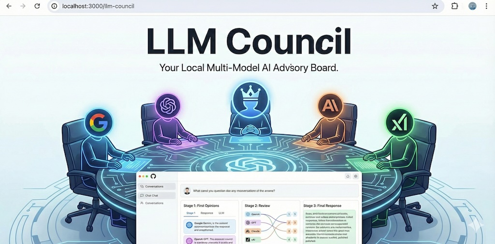

# LLM Council (My Debate-to-Consensus Take)



Inspired by the original author’s LLM Council repo, this is my own take on using multiple LLM instances to solve large-context problems.

The core idea: run multiple strong models independently first, then force a cross-model debate until there is consensus on:

1. the definitive best plan
2. which models should implement which parts

Then execute that plan.

## Methodology

This implementation uses 6 models:

- GPT-5.2
- Codex-5.3
- Opus-4.6
- Sonnet-4.6
- Gemini-3-Pro
- Grok

The workflow is:

1. **Stage 1 — Independent Planning**  
   Each model receives the exact same problem and creates an implementation plan in isolation.
2. **Stage 2 — Debate to Consensus**  
   Models are given each other’s plans and debate until consensus is reached on the best approach plus task ownership.
3. **Stage 3 — Assigned Execution**  
   Assigned models execute their parts; the coordinator integrates outputs into the final answer.

This pattern works for:

- coding tasks
- strategic planning
- ideation / synthesis

## Environment Setup

### 1) Install dependencies

Backend (Python):

```bash
uv sync
```

Frontend (React):

```bash
cd frontend
npm install
cd ..
```

### 2) Configure OpenRouter API key

Create `.env` in project root:

```bash
OPENROUTER_API_KEY=sk-or-v1-...
```

### 3) Verify / customize model IDs

Default model configuration is in `backend/config.py`:

```python
COUNCIL_MODELS = [
    "openai/gpt-5.2",
    "openai/codex-5.3",
    "anthropic/claude-opus-4.6",
    "anthropic/claude-sonnet-4.6",
    "google/gemini-3-pro",
    "x-ai/grok-4",
]
```

If your OpenRouter account uses slightly different IDs for these models, adjust them there.

## Run

### Option A: script

```bash
./start.sh
```

### Option B: manual

Backend:

```bash
uv run python -m backend.main
```

If `uv` is not available in your environment, use:

```bash
python3 -m backend.main
```

Frontend:

```bash
cd frontend
npm run dev
```

Open: http://localhost:5173

## Tech Stack

- **Backend:** FastAPI + async httpx + OpenRouter
- **Frontend:** React + Vite + react-markdown
- **Storage:** JSON conversation files under `data/conversations/`
